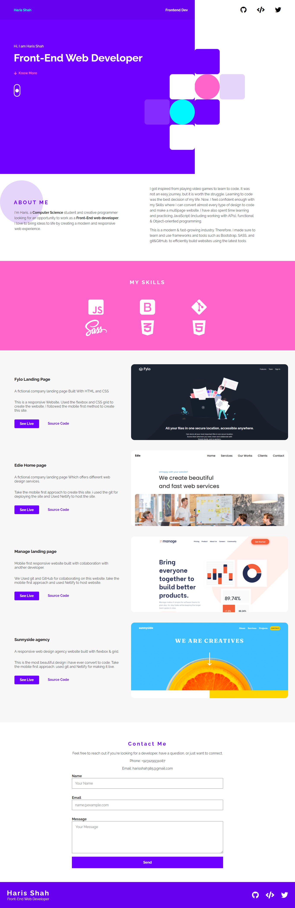
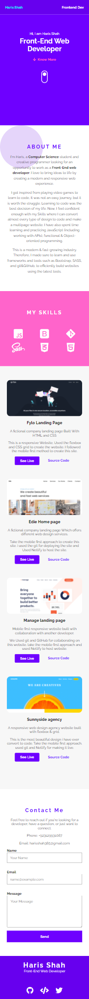

# Haris Shah Portfolio Site

This is my personal portfolio site. I will upload all my personal projects to this website.

## Table of contents

- [The overview](#the-overview)
- [Screenshot](#screenshot)
- [Links](#links)
- [My process](#my-process)
- [Built with](#built-with)
- [Author](#author)

### The overview

This Website should :

- Work on all screen sizes and different layout on the users browser
- See hover states for all interactive elements on the page

### Screenshot

### Links

- Source code URL: [GitHub](https://github.com/hariscs/myportfolio)
- Live Site URL: [Haris](https://harisshah.codes/)

## My process

- Take the mobile first approach, used a media query for larger screens.

### Built with

- Semantic HTML5 markup
- SASS
- FlexBox
- CSS Grid
- Mobile-first workflow
- GSAP for animations

## Author

- GitHub - [@hariscs](https://github.com/hariscs)
- Twitter - [@\_haris_shah](https://www.twitter.com/_haris_shah)
